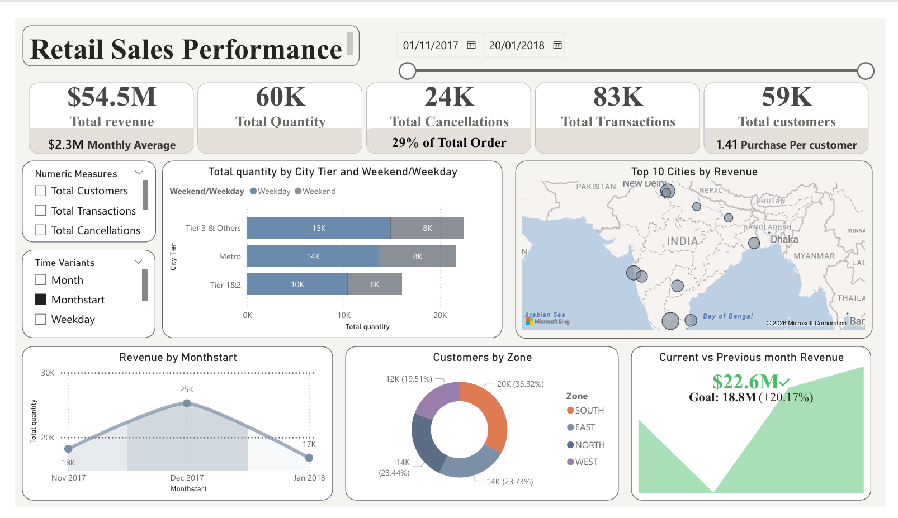

# 🛍️ Retail Sales Performance Dashboard — Power BI


> A single-page Power BI dashboard delivering a 360° view of retail sales performance across Indian cities — tracking revenue, cancellations, customer behaviour, and geographic distribution across a 3-month window.

---

## 📋 Table of Contents

1. [Executive Summary](#executive-summary)
2. [Objective](#objective)
3. [Dataset Description](#dataset-description)
4. [Data Model](#data-model)
5. [DAX Measures](#dax-measures)
6. [Dashboard Walkthrough](#dashboard-walkthrough)
7. [How to Use the Report](#how-to-use-the-report)
8. [Download & Setup](#download--setup)

---

## Executive Summary

This Power BI report analyses **83,374 retail sales transactions** spanning **November 2017 to January 2018** across cities in India. It surfaces performance trends by geography, city tier, time period, and product group through a tightly focused single-page dashboard with dynamic slicers.

**Headline numbers:**

| KPI | Value |
|---|---|
| 💰 Total Revenue | $54.5M |
| 📦 Total Net Units Sold | 60K |
| ❌ Total Cancellations | 24K (29% of orders) |
| 🔁 Total Transactions | 83K |
| 👥 Unique Customers | 59K |
| 📅 Monthly Average Revenue | $2.3M |
| 🛒 Customer Purchase Frequency | 1.41 purchases/customer |

---

## Objective

The goal of this project is to build a clean, interactive retail performance dashboard that answers the following business questions:

1. How is overall revenue trending month-on-month?
2. Which cities and geographic zones are driving the most revenue?
3. How do Metro, Tier 1&2, and Tier 3 cities compare in unit sales?
4. What is the cancellation rate, and how does it impact net performance?
5. Is performance this month ahead of or behind the previous month?
6. How do weekday versus weekend sales patterns differ by city tier?

---

## Dataset Description

The model is built on **four raw datasets** stored in the `/Dataset` folder of this repository.

---

### 📊 Mod3_Raw_Sales_v0.1.xlsx — Sales Raw (Fact Table)

The primary transaction-level dataset containing every order placed on the platform.

| Column | Type | Description |
|---|---|---|
| `OrderDate` | Date | Date the order was placed |
| `UserId` | Text | Unique customer identifier |
| `ProductId` | Integer | Product identifier |
| `PinCode` | Integer | Delivery pin code |
| `Revenue` | Integer | Revenue generated from the order (INR) |
| `Units` | Integer | Total units ordered |
| `Cancelled_Units` | Integer | Units that were cancelled |

> **Scale:** 83,374 rows | 7 raw columns | Transaction-level granularity
>
> **Note:** Two columns are engineered in Power Query — `Transaction_Id` (index) and `Net Units` (Units − Cancelled_Units)

---

### 📍 Mod3_Raw_PinCodeGeo_v0.1.xlsx — PinCode-Geo (Dimension)

Maps each pin code to a city and geographic zone across India.

| Column | Type | Description |
|---|---|---|
| `PinCode` | Integer | Indian postal pin code |
| `City` | Text | City name (e.g., "New Delhi, India") |
| `Zone` | Text | Geographic zone: NORTH, SOUTH, EAST, WEST |

> **Scale:** 9,222 rows | 3 columns

---

### 🏙️ Mod3_Raw_CityTier_v0.1.csv — City_Tier (Dimension)

Classifies each city into a tier category for segment-level analysis.

| Column | Type | Description |
|---|---|---|
| `City` | Text | City name |
| `CityTier` | Text | Tier classification: Metro, Tier 1&2, Tier 3 & Others |

> **Scale:** 2,129 rows | 2 columns

---

### 🏷️ Mod3_Raw_ProductMap_v0.1.csv — ProductMap (Dimension)

Maps product IDs to their product group.

| Column | Type | Description |
|---|---|---|
| `ProductId` | Integer | Unique product identifier |
| `ProductGroup` | Text | Product category (e.g., Tshirts_Men) |

> **Scale:** 13,388 rows | 2 columns

---

## Data Model

The report follows a **Star Schema** with `Sales Raw` as the central fact table, surrounded by four dimension tables.


```
                    ┌──────────────────────────┐
                    │       Date (Dim)          │
                    │  CALENDARAUTO()           │
                    │  Date, Month, Monthstart  │
                    │  Weekday, Weekend/Weekday │
                    └────────────┬─────────────┘
                                 │ 1
                                 │ (OrderDate)
                                 │ *
┌───────────────┐   ┌────────────▼──────────────────────────┐   ┌──────────────────┐
│  City_Tier    │   │           Sales Raw (Fact)             │   │   ProductMap     │
│  City Old  1◄─┼───┤* City Old  Transaction_Id             ├──►│ 1 ProductId      │
│  City Tier    │   │  OrderDate  Revenue  Units             │   │   ProductGroup   │
└───────────────┘   │  Cancelled_Units  Net Units  PinCode  │   └──────────────────┘
                    └────────────────────┬──────────────────┘
                                         │ *
                                         │ (PinCode)
                                         │ 1
                    ┌────────────────────▼─────────────────┐
                    │           PinCode-Geo (Dim)           │
                    │   PinCode, City Old, Zone             │
                    └──────────────────────────────────────┘
```

### Relationship Details

| From Table | From Column | To Table | To Column | Cardinality |
|---|---|---|---|---|
| Sales Raw | `OrderDate` | Date | `Date` | Many-to-One |
| Sales Raw | `PinCode` | PinCode-Geo | `PinCode` | Many-to-One |
| PinCode-Geo | `City Old` | City_Tier | `City Old` | Many-to-One |
| Sales Raw | `ProductId` | ProductMap | `ProductId` | Many-to-One |

### Data Engineering Notes

- **Transaction_Id** — Not present in the source data. Generated in Power Query by adding an index column starting at 1, then reordered to the first position.
- **Net Units** — Calculated column derived as `Units − Cancelled_Units`, representing units that were not cancelled.
- **City column bridging** — In `PinCode-Geo`, the original `City` column was renamed to `City Old` to create a clean join key to `City_Tier`, which also uses `City Old` as its primary key.
- **Date table** — Built using `CALENDARAUTO()`, which auto-detects the min/max dates from all date columns in the model. Extended with calculated columns: Monthstart, Month_Year, Orderdayofweek, Weekday, Weekend/Weekday.

### Supporting Tables

| Table | Type | Purpose |
|---|---|---|
| `KPIs` | Measures Table | Central repository for all 9 DAX measures |
| `Categorical Parameters` | Field Parameter | Dynamically switch categorical dimensions in visuals |
| `Numeric Parameters` | Field Parameter | Switch between numeric KPI metrics |
| `Time Variants` | Field Parameter | Toggle between time granularities (Monthstart, Month, Weekday) |

---

## DAX Measures

All measures are housed in the `KPIs` table for clean separation from raw data columns.

| Measure | DAX Expression | Purpose |
|---|---|---|
| **Total Revenue** | `SUM('Sales Raw'[Revenue])` | Sum of all revenue across filtered context |
| **Total Quantity** | `SUM('Sales Raw'[Net Units])` | Net units sold (after cancellations) |
| **Total Cancellations** | `SUM('Sales Raw'[Cancelled_Units])` | Total units cancelled |
| **Total Customers** | `DISTINCTCOUNT('Sales Raw'[UserId])` | Count of unique customers |
| **Total Transactions** | `COUNT('Sales Raw'[Transaction_Id])` | Total number of order transactions |
| **Previous Month Sales** | `CALCULATE([Total Revenue], DATEADD('Date'[Date], -1, MONTH))` | Revenue for the prior month using time intelligence |
| **Percentage Cancellation** | `DIVIDE([Total Cancellations], SUM('Sales Raw'[Units]))` | Cancellation rate as % of gross units ordered |
| **Average Monthly Revenue** | `DIVIDE([Total Revenue], DISTINCTCOUNT('Date'[Month_Year]))` | Revenue averaged across distinct months in context |
| **Customer Purchase Frequency** | `[Total Transactions] / [Total Customers]` | Average orders placed per unique customer |

---

## Dashboard Walkthrough

The report is delivered as a **single, interactive page** titled **Retail Sales Performance**.



### KPI Header Strip

Seven headline metrics are displayed across the top of the dashboard, giving instant visibility into overall health:

- **$54.5M** Total Revenue
- **60K** Total Net Units
- **24K** Total Cancellations — flagged as **29% of Total Orders**
- **83K** Total Transactions
- **59K** Total Customers
- **$2.3M** Monthly Average Revenue
- **1.41** Customer Purchase Frequency

---

### Dynamic Slicers

Two field-parameter slicers allow users to reshape the visuals without switching pages:

- **Numeric Measures** — Switch the KPI cards between Total Customers, Total Quantity, Total Transactions, and Total Cancellations
- **Time Variants** — Switch the time axis of charts between Monthstart, Month, and Weekday granularity

---

### Total Quantity by City Tier & Weekend/Weekday

A grouped bar chart comparing net unit sales across three city tiers (Metro, Tier 1&2, Tier 3 & Others) broken down by whether the order was placed on a weekday or weekend.

**Insight:** Reveals whether high-volume tiers are driven by weekday corporate purchasing or weekend consumer demand.

---

### Top 10 Cities by Revenue — India Map

A filled map visual plotting the top 10 revenue-generating cities geographically across India, with bubble size indicating revenue contribution.

**Insight:** Enables regional teams to identify which cities deserve prioritised marketing and logistics investment.

---

### Revenue by Monthstart (Trend Line)

A line chart tracking total revenue across monthly periods, enabling month-on-month trend identification across the Nov 2017 – Jan 2018 window.

---

### Customers by Zone (Donut Chart)

A donut chart breaking down the 59K unique customers by geographic zone:

| Zone | Share |
|---|---|
| NORTH | ~28.2% |
| SOUTH | ~27.9% |
| WEST | ~21.6% |
| EAST | Remainder |

**Insight:** Revenue is fairly balanced across zones, with NORTH and SOUTH leading slightly — making India-wide campaigns viable rather than requiring heavy regional targeting.

---

### Current vs Previous Month Revenue

A KPI card with goal tracking showing:
- **Current Month Revenue:** $22.6M
- **Previous Month Revenue (Goal):** $18.6M
- **Growth:** +17% vs prior month

**Insight:** Built using the `Previous Month Sales` measure with `DATEADD` time intelligence, this card provides instant MoM performance context.

---

## How to Use the Report

### Slicers
Use the **Numeric Measures** slicer on the left to switch all KPI cards between different metrics. Use the **Time Variants** slicer to change the time axis on trend charts between monthly and weekday granularity.

### Cross-Filtering
Click any bar, slice, or map bubble to cross-filter all other visuals on the page to that selection. Click again or press **Ctrl+Z** to clear the filter.

### Date Filtering
The report covers **01 Nov 2017 – 20 Jan 2018**. The date table is built with `CALENDARAUTO()` so it will extend automatically if new data is loaded.

---

## Download & Setup

### Prerequisites
- **Power BI Desktop** (free) — [Download here](https://powerbi.microsoft.com/en-us/desktop/)
- Windows 10 or later

### Steps to Open the Report

1. **Clone or download this repository:**
   ```
   git clone https://github.com/Anandukaran/PowerBI---Retail-Sales-Analysis.git
   ```
   Or click **Code → Download ZIP** on the repository page.

2. **Navigate to the `Main Files` folder** inside the downloaded repository.

3. **Open** `Retail Sales Dashboard.pbix` **with Power BI Desktop.**

4. The report will load with all data pre-embedded. No additional connection setup is required.

5. *(Optional)* To refresh with new data, replace the dataset files in the `Dataset` folder and update the file paths in **Home → Transform Data → Data Source Settings**.

### File Reference

| File | Location | Description |
|---|---|---|
| `Retail Sales Dashboard.pbix` | `/Main Files/` | Power BI report file |
| `Retail Sales Dashboard.pdf` | `/Main Files/` | PDF export of the dashboard |
| `Mod3_Raw_Sales_v0.1.xlsx` | `/Dataset/` | Fact table — 83K sales transactions |
| `Mod3_Raw_PinCodeGeo_v0.1.xlsx` | `/Dataset/` | Pin code to city & zone mapping |
| `Mod3_Raw_CityTier_v0.1.csv` | `/Dataset/` | City tier classification |
| `Mod3_Raw_ProductMap_v0.1.csv` | `/Dataset/` | Product ID to product group mapping |
| Dashboard Screenshot | `/Images/` | PNG export of the report page |
| Data Model Screenshot | `/Images/` | PNG of the Power BI data model view |

---

<div align="center">

**Built with ❤️ using Power BI Desktop**

[⬆ Back to Top](#️-retail-sales-performance-dashboard--power-bi)

</div>
